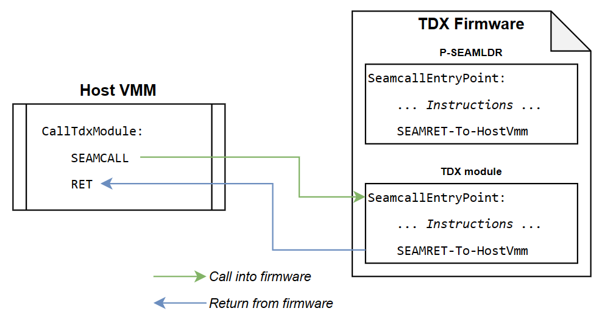
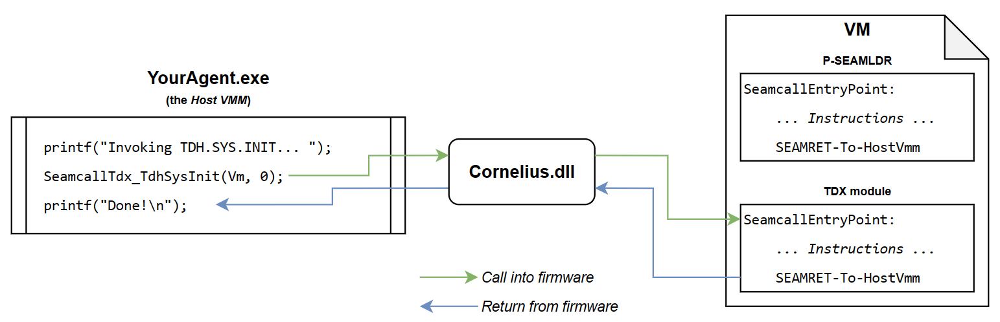
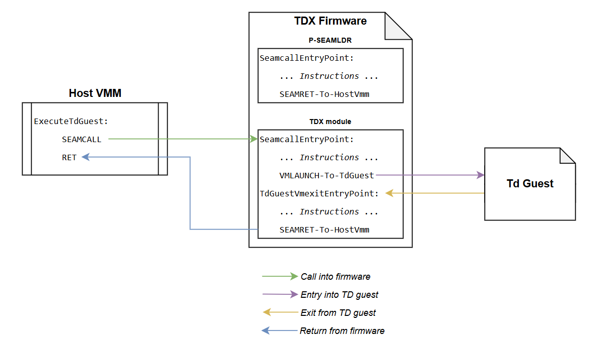
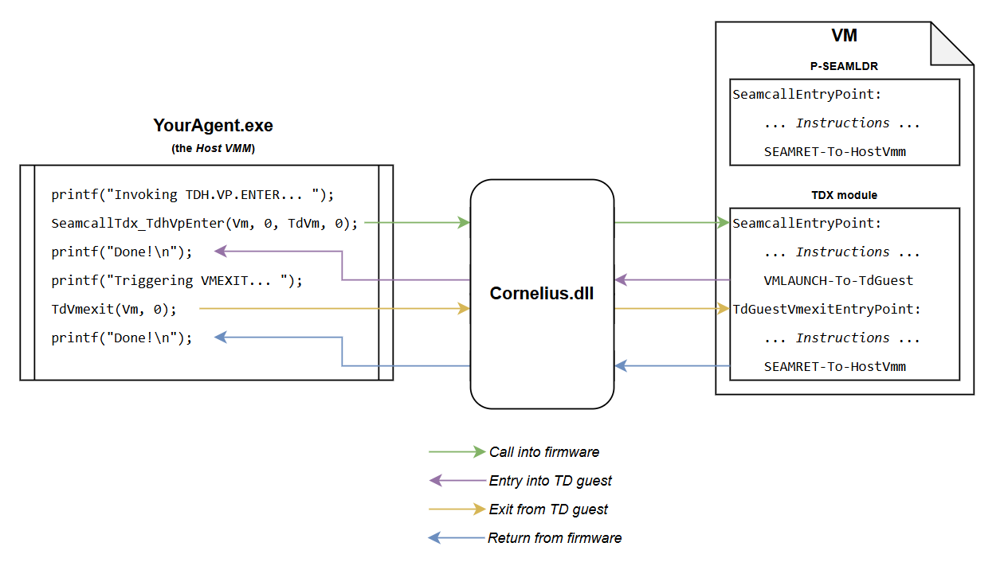

# Cornelius

Cornelius is a specialized emulator that allows to run the [Intel TDX](https://www.intel.com/content/www/us/en/developer/tools/trust-domain-extensions/overview.html)
firmware as a VM on Hyper-V without requiring actual TDX hardware. It is useful for security testing, fuzzing, and rapid prototyping of the TDX firmware.

Cornelius was developed by the Microsoft MORSE team.

## Features

 - Allows to run the P-SEAMLDR and the TDX module in a VM without requiring TDX hardware.
 - Supports VM snapshotting, to easily implement fuzzers.
 - Provides support for ASAN, UBSAN and SANCOV in the P-SEAMLDR and TDX module.
 - Performs runtime invariant checking.
 - Allows to exercise both the Hypervisor-to-TDX and Guest-to-TDX attack surfaces.

## Pre-requisites

 - Microsoft VisualStudio.
 - Latest Windows 11 with Hyper-V and [WHP](https://learn.microsoft.com/en-us/virtualization/api/hypervisor-platform/hypervisor-platform) enabled.
 - Intel Gen11 CPU or higher (note: the CPU does not need to support TDX).

## Code structure

 - `Lib`: builds the `Cornelius.dll` library which implements the emulator, and exposes an API.
 - `Test`: implements a demonstrator, that uses the Cornelius API to run the TDX firmware.
 - `TdxPatches`: patches to apply to the P-SEAMLDR and TDX module source code.

> [!NOTE]
> The patches to enable sanitizers will be published in the near future

## How to use

 - Build the P-SEAMLDR and TDX module:
     - Obtain the source code from the official Intel website.
     - Apply the patches from the `TdxPatches` directory on that source code.
     - Compile the P-SEAMLDR and TDX module.
     - You should now have three binaries: `pseamldr.so.consts`, `pseamldr.so`, `libtdx.so`.
 - Open `Cornelius.sln` with VisualStudio, and rebuild the project.
 - The `Binaries` directory is now created and contains `Cornelius.dll` and `Test.exe`.
 - Copy the TDX binaries into that folder.
 - Go to that folder and run the demonstrator: `.\Test.exe pseamldr.so.consts pseamldr.so libtdx.so`.

You can now develop your own demonstrator, or fuzzer, or tester, using `Cornelius.dll`.

## How it works

What follows is a simplified rundown of TDX and Cornelius, please refer to the Intel TDX documentation for more details on TDX,
and to the demonstrator for details on Cornelius.

### SEAMCALLs and SEAMRETs

Natively, the host VMM invokes either the P-SEAMLDR or the TDX module using the `SEAMCALL` instruction, and the firmware
then returns using the `SEAMRET` instruction.

Cornelius emulates `SEAMCALL`s by executing the firmware at the SEAMCALL entry point, and stopping the
execution when encountering a `SEAMRET` instruction. These mechanics are abstracted in simple functions
exposed by Cornelius:

 - `SeamcallPseamldr_*()`: do a `SEAMCALL` into the P-SEAMLDR.
 - `SeamcallTdx_*()`: do a `SEAMCALL` into the TDX module.

### Execution of TD guests

Natively, the host VMM invokes the `TDH.VP.ENTER` command of the TDX module, and the TDX module then jumps into
the TD guest, which executes until a VMEXIT occurs. When a VMEXIT occurs, the CPU jumps back into the TDX module,
which in turn returns back to the host VMM that initially invoked the command.

In Cornelius, the TdxModule->TdGuest jumps cause a return to the caller, who is therefore considered as being in
the context of the TD guest. The caller is free to trigger any VMEXIT from there back into the TDX module.

This allows the caller to emulate both the context of the host VMM **and** the context of TD guests.

## Contributing

This project welcomes contributions and suggestions.  Most contributions require you to agree to a
Contributor License Agreement (CLA) declaring that you have the right to, and actually do, grant us
the rights to use your contribution. For details, visit https://cla.opensource.microsoft.com.

When you submit a pull request, a CLA bot will automatically determine whether you need to provide
a CLA and decorate the PR appropriately (e.g., status check, comment). Simply follow the instructions
provided by the bot. You will only need to do this once across all repos using our CLA.

This project has adopted the [Microsoft Open Source Code of Conduct](https://opensource.microsoft.com/codeofconduct/).
For more information see the [Code of Conduct FAQ](https://opensource.microsoft.com/codeofconduct/faq/) or
contact [opencode@microsoft.com](mailto:opencode@microsoft.com) with any additional questions or comments.

## Trademarks

This project may contain trademarks or logos for projects, products, or services. Authorized use of Microsoft 
trademarks or logos is subject to and must follow 
[Microsoft's Trademark & Brand Guidelines](https://www.microsoft.com/en-us/legal/intellectualproperty/trademarks/usage/general).
Use of Microsoft trademarks or logos in modified versions of this project must not cause confusion or imply Microsoft sponsorship.
Any use of third-party trademarks or logos are subject to those third-party's policies.
